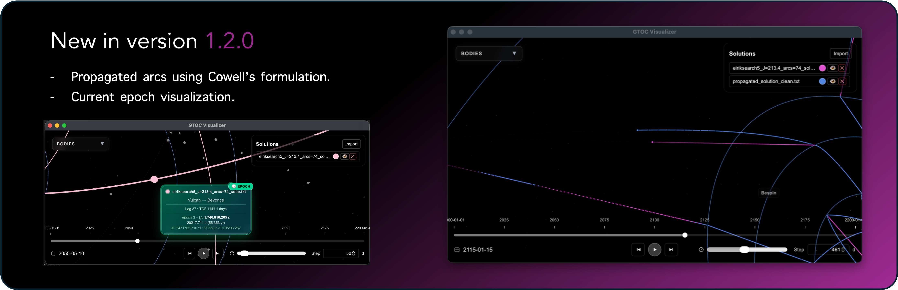

# GTOC 13 Visualizer

> [!NOTE]
> Version **1.2.0** introduces major improvements!  
>  
> 

>   
> 

> 
> 🪐 Includes **body selection**, allowing you to visualize one or multiple planets, asteroids, or comets interactively.
> 🪐 Includes **conic arcs**, using Cowell's Formulation. Which uses an IVP approach to propagate the orbits.
> 🪐 Includes **current epoch**, when hovering over the current location.

---

## Download / Install

Navigate to the `download` folder.  
Select either the Windows/Linux installer (`GTOC_Visualizer_X.X.X_x64-setup.exe`) or the macOS one (`GTOC_Visualizer_X_X_X.zip`).

> [!WARNING]
> **MacOS users:** If you see the message  
> *“Apple can’t check app for malicious software…”*  
> follow these steps:
> 1. Apple menu → **System Settings** → **Privacy & Security**
> 2. Under **Security**, click **Open**
> 3. Click **Open Anyway**
> 4. Enter your password, click **OK**

---

## Requirements
- macOS: Supports macOS 10.13 and above
