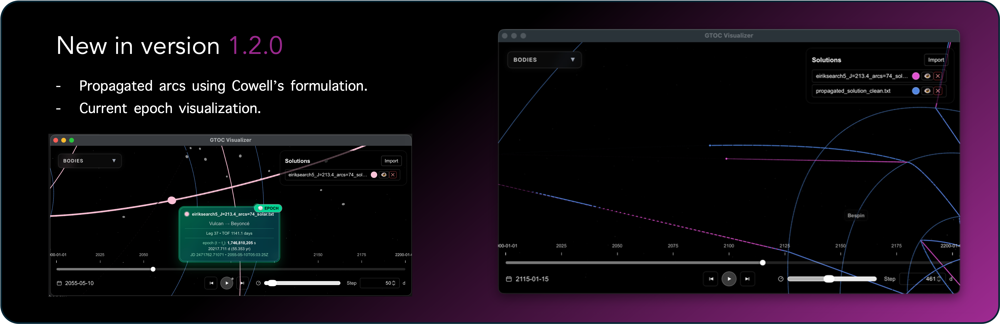

# GTOC 13 Visualizer

> [!NOTE]
> Version **1.2.2** — latest release!  
> <br>
> <p align="center">
>   
> </p>
> 
> **Rocket ship marker** that orients in the direction of travel  
> **Body selection** — visualize planets, asteroids, or comets interactively  
> **Conic arcs** using Cowell's Formulation (IVP orbit propagation)  
> **Movie mode** with fullscreen presentation and 4K export

---

## Download / Install

Download the latest version from **GitHub Releases**:

<p align="center">
  <a href="https://github.com/LuisPostigo/GTOC_visualizer/releases/latest">
    
  </a>
</p>

### Pick your platform

<p align="center">
  <a href="https://github.com/LuisPostigo/GTOC_visualizer/releases/latest">
    
  </a>
  <a href="https://github.com/LuisPostigo/GTOC_visualizer/releases/latest">
    
  </a>
  <a href="https://github.com/LuisPostigo/GTOC_visualizer/releases/latest">
    
  </a>
</p>

### Which file do I download?

| Platform | File | Description |
|----------|------|-------------|
| **Windows** | `Vectra_*_x64-setup.exe` | Recommended installer (NSIS) |
| **Windows** | `Vectra_*_x64_en-US.msi` | Alternative MSI installer |
| **macOS** | `Vectra_*_aarch64.dmg` | Disk image for Apple Silicon (M1/M2/M3/M4) |
| **Linux** | `Vectra_*.AppImage` | Portable — runs on any distro |
| **Linux** | `Vectra_*_amd64.deb` | Debian/Ubuntu package |
| **Linux** | `Vectra_*_x86_64.rpm` | Fedora/RHEL package |

> **Tip:** If you're unsure, use the **`.exe` installer** on Windows, the **`.dmg`** on macOS, or the **`.AppImage`** on Linux.

---

> [!WARNING]
> macOS: "Vectra is damaged and can't be opened"
> macOS Gatekeeper blocks apps that aren't signed with an Apple Developer certificate. This is expected for community-built releases.
> **To fix it**, open Terminal and run:
> ```bash
> # If you already dragged Vectra to Applications:
> xattr -cr /Applications/Vectra.app
> # Or remove quarantine from the .dmg before opening:
> xattr -d com.apple.quarantine ~/Downloads/Vectra_1.2.2_aarch64.dmg
> ```
> Alternatively, **right-click** the app and choose **Open** (instead of double-clicking). macOS will show a warning but will give you an **"Open"** button to bypass it.

---

## Requirements

- **macOS:** 10.15 (Catalina) or later — Apple Silicon native
- **Windows:** Windows 10 or later (x64)
- **Linux:** Any modern distro with GTK 3 and WebKit2GTK 4.1
